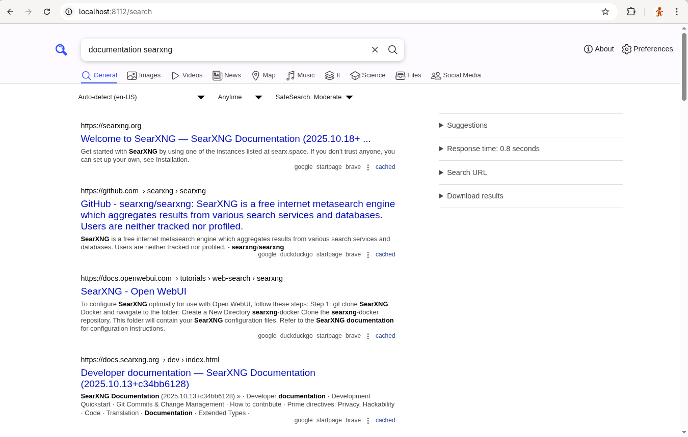
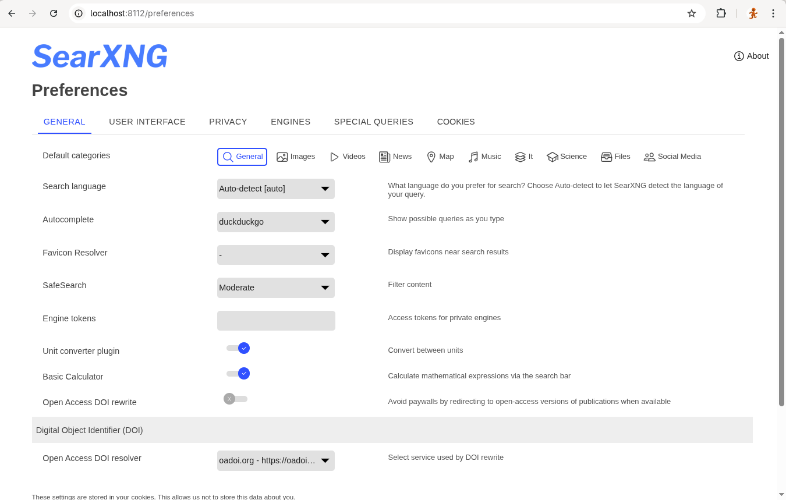
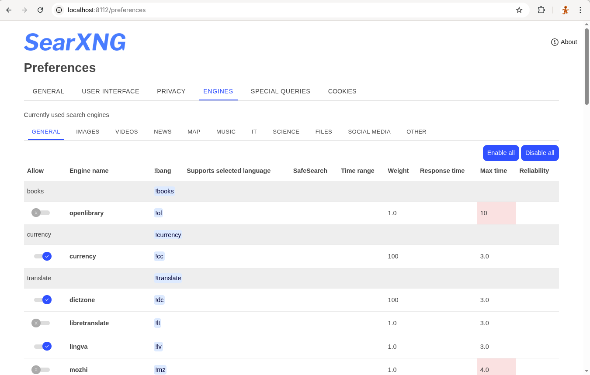

# SearXNG on Fedora (Podman + systemd) — Setup & Ops

This repo contains a simple way to run **SearXNG** in a Podman container on Fedora and expose it for **Open‑WebUI** as a web‑search backend.

> Tested on Fedora Workstation with Podman. Service runs as a systemd **system** unit by default.

## Overview
SearXNG is a free, open-source metasearch engine: it sends your query to many other search engines (Google, Bing, DuckDuckGo, Qwant, Wikipedia, etc.), merges the results, and strips tracking so you aren’t profiled. It’s the actively-maintained successor to the older “searx.” 

### Key points

* **Privacy-friendly**: doesn’t track users; removes identifying data from upstream requests. 
* **Many sources**: supports dozens of engines and result categories (Web, Images, Videos, News, IT, Science, etc.). 
* **Self-host or use a public instance**: you can run your own server or use one from a community-maintained list. 
* **Provides Web Serarch for LLM tools**: Tools like Open-webUI can use the SearXNG API for their Web Search calls.
* **Open source & license**: code is on GitHub under AGPL-3.0. 
* **Why “SearXNG” vs “searx”**? SearXNG is the continuation with faster updates and more features; searx itself has seen reduced/ended development.



## Contents

- `install-searxng.sh` — installer/updater (creates folders, installs unit, pulls image)
- `searxng.service` — systemd unit that runs the container
- `settings.yml` — SearXNG config (mounted at `/etc/searxng` inside the container)
- `healthcheck.sh` — small curl‑based health check

## Podman or Docker

**Podman** and **Docker** are largely interchangeable for most use cases: both follow OCI standards and share image formats, registries, volume semantics, and networking, so typical workflows are compatible. Unlike Docker, Podman is daemonless. It runs containers directly as regular processes (well-suited to rootless operation) without a central background service. So whenever you see **podman** in this instruction you can also use **docker**.

## Quick start

```bash
# 1) Install dependencies
sudo dnf install -y podman

# 2) Run the installer (creates /opt/searxng, installs service)
sudo bash install-searxng.sh

# 3) Test (HTML & JSON)
curl -fsS "http://localhost:8112/search?q=searxng" | head -n 5
curl -fsSG "http://localhost:8112/search" --data-urlencode "q=searxng" --data-urlencode "format=json" | jq .
```

Open **Open‑WebUI → Admin → Settings → Web Search** and set:

- **Provider:** `SearXNG`
- **SearXNG Query URL:** `http://localhost:8112/search?q=<query>`  
  (If Open‑WebUI runs in a container on the same host, you can use `http://host.containers.internal:8112/search?q=<query>`.)

## Configuration

The service mounts:

- `/opt/searxng/config → /etc/searxng` (settings and limiter files)
- `/opt/searxng/data   → /var/cache/searxng` (cache)

Edit `/opt/searxng/config/settings.yml` or `/etc/systemd/system/searxng.service` and restart:

```bash
sudo systemctl daemon-reload            # only when searxng.service is changed.
sudo systemctl restart searxng.service
```

### Minimal recommended settings

/opt/searxng/config/settings.yml
```yaml
# SearXNG settings — minimal & Open-WebUI-friendly
# Place as /opt/searxng/config/settings.yml (mounted to /etc/searxng inside the container)

use_default_settings: true

# UI language only; does NOT change search language.
ui:
  default_locale: nl

# Branding
general:
  debug: false
  instance_name: "SearXNG"

# Search behavior & API 
search:
  # Safe search level (0=off, 1=moderate, 2=strict)
  safe_search: 1
  # Autocomplete source
  autocomplete: 'duckduckgo'
  # JSON is required for Open-WebUI / curl tests
  formats:
    - html
    - json
  # POST leaks less referrer than GET
  method: POST
  # Default language/locale of the SEARCH RESULTS (not the UI)
  default_lang: en
  language:
    - en
    - en-US
    - en-GB
    - nl

server:
  secret_key: "REPLACE_WITH_YOUR_OWN_RANDOM_HEX"
  # Turn limiter off if you don’t run Valkey (recommended for local-only use)
  limiter: false
  # Proxy images for privacy
  image_proxy: true
  # Fixes links/redirects; adjust when using a reverse proxy.
  base_url: "http://localhost:8112/"

# Valkey (only needed when you set limiter=true)
# valkey:
#   url: "valkey://localhost:6379/0"

outgoing:
  # Global timeout for engines (can be overridden per engine via `timeout`)
  request_timeout: 5.0
  
  # (optional) a contact suffix can help when requesting unblocks
  # useragent_suffix: " | admin@example.org"

  # In case you need to configure a http proxy to access internet.
  # proxies:
  #  all://:
  #    - "http://your-http-proxy:8080"

# preferences:
#   lock:
#     - autocomplete
#     - method

# Plugins (optional, safe defaults)
#plugins:
#  - plugin: "Open Access DOI"
#    default_on: true
#  - plugin: "Auto-Search-on-Category-Select"
#    default_on: true

# engines: enable only the ones you actually use; give each a timeout
engines:
  - name: duckduckgo
    disabled: false
    categories: general
    timeout: 5.0

  - name: wikipedia
    disabled: false
    categories: knowledge
    timeout: 5.0

#   # For paid/official APIIs (more stable than scraping-based engines):
#   - name: google_cs            # Google Custom Search JSON API
#     disabled: true
#     api_key: "${GOOGLE_API_KEY}"
#     engine: google_cs
#     cx: "${GOOGLE_CX}"
#     categories: general
#     timeout: 3.0
```

## Systemd service

The provided `searxng.service` maps host port **8112 → 8080** in the container and mounts config/data with SELinux `:Z` labels.

Restart/status:

```bash
sudo systemctl restart searxng.service
sudo systemctl status searxng.service -n 50
sudo journalctl -u searxng.service -e
```

## Health check

API‑level health (JSON + engine check):

```bash
bash scripts/healthcheck.sh
OK: SearXNG healthy — HTML up, JSON API up (q='ping' engines='auto').
```

## UI settings

General preferences



Engines



## Troubleshooting

- **403 / JSON disabled** → ensure `search.formats` includes `json`.
- **Limiter errors (Valkey connection refused)** → either set `server.limiter: false` or run Valkey and set `valkey.url`.
- **SELinux denials** → make sure Podman volume mounts include `:Z`.
- **Open‑WebUI cannot reach SearXNG in a container** → use `http://host.containers.internal:8112/` from inside the container.

## Updating

```bash
# Pull latest image & restart
sudo systemctl stop searxng.service
sudo podman pull ghcr.io/searxng/searxng:latest
sudo systemctl start searxng.service

# Or use the helper:
sudo bash install-searxng.sh --update
```

## documentation

* https://github.com/searxng/searxng
* https://docs.searxng.org/admin/settings/index.html

## License

This repo contains only configuration and scripts. SearXNG is licensed under AGPL‑3.0; see the upstream project for details.